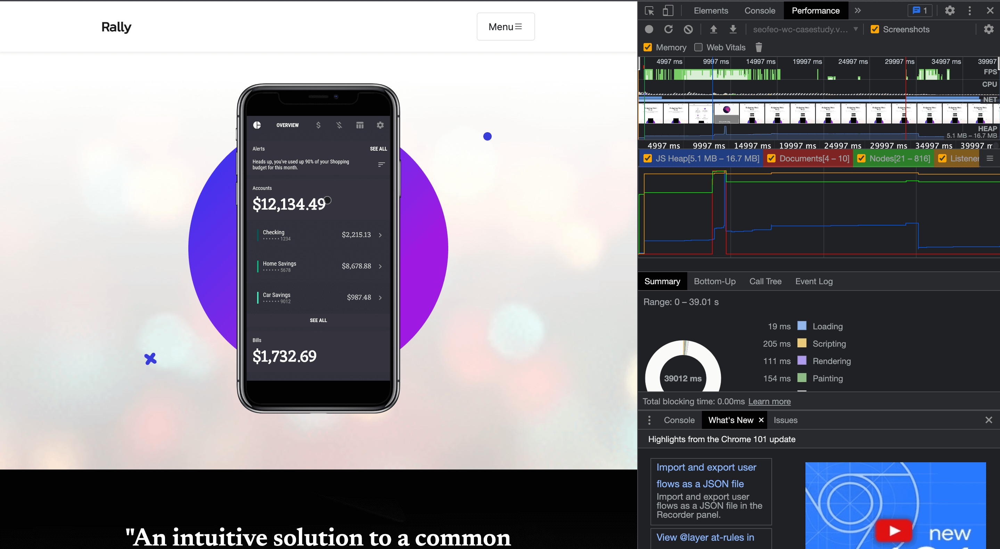
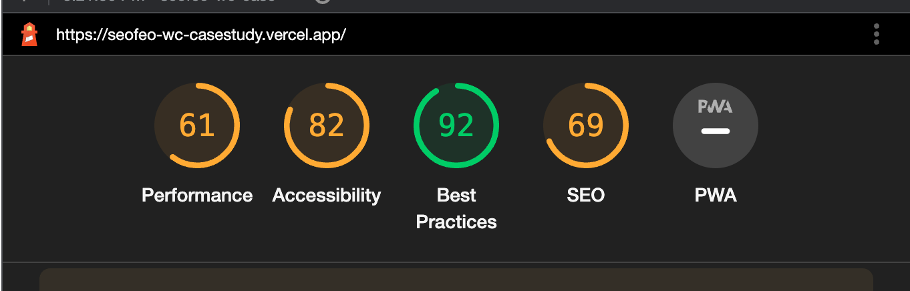

# WC SEO & FO Case Study

> White Cloak's Case Study for applying techniques in Technical SEO (Search Engine Optimization) Implementation and Frontend Optimization



## Goal

Your goal is to apply the techniques you learned from the video sessions about Search Engine Optimization and Frontend Optimization, to create an optimized version of this web application.



> Google DevTools Lighthouse Metrics before optimization

You need to increase the following metrics shown above by implementing proper Search Engine Optimization and Frontend Optimization.

### Live Demo Site

You can access the live demo website here:
https://seofeo-wc-casestudy.vercel.app/

### Getting Started

1. Clone Repository

```
git clone https://gitlab.com/bryce.mercines/wc-seofo-cs
```

2. Run the development server:

```bash
npm run dev
# or
yarn dev
```

### Mechanics

- Don't upload your progress in a branch. To avoid other Trainees from copying each other's work.
- You may implement your changes and present the results locally, or deploy them on Vercel using a free account.
- You can Implement any combination of Optimization techniques to achieve the goal of creating an optimized version of the web application.
- You may change assets, files, styling, and content. As long as it still fits the Branding of the marketing site and it improves the performance.
- Once you are done, you may submit your results to your Training Coordinator.

### Goodluck!

### Learn More about NextJS

To learn more about Next.js, take a look at the following resources:

- [Next.js Documentation](https://nextjs.org/docs) - learn about Next.js features and API.
- [Learn Next.js](https://nextjs.org/learn) - an interactive Next.js tutorial.

You can check out [the Next.js GitHub repository](https://github.com/vercel/next.js/) - your feedback and contributions are welcome!

### Deploy on Vercel

The easiest way to deploy your Next.js app is to use the [Vercel Platform](https://vercel.com/new?utm_medium=default-template&filter=next.js&utm_source=create-next-app&utm_campaign=create-next-app-readme) from the creators of Next.js.

Check out our [Next.js deployment documentation](https://nextjs.org/docs/deployment) for more details.

### Credits

Special thanks to these projects:
https://github.com/StartBootstrap/startbootstrap-new-age
